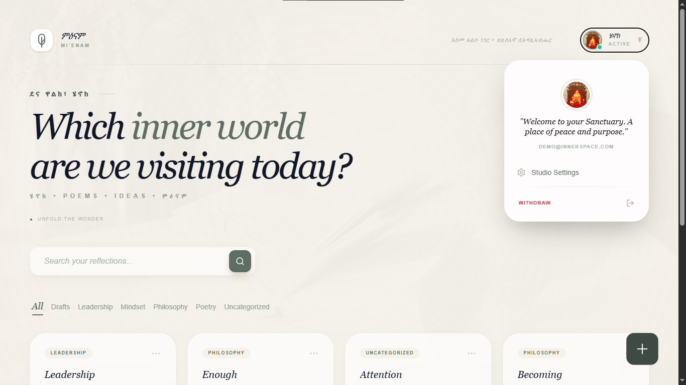
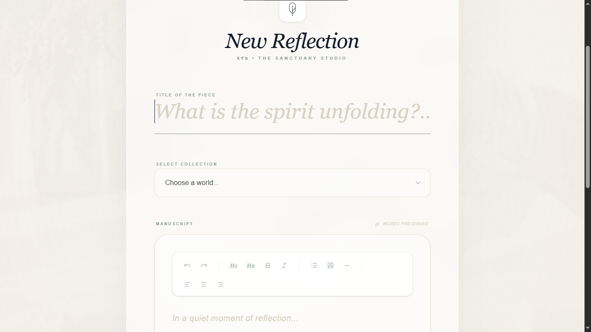
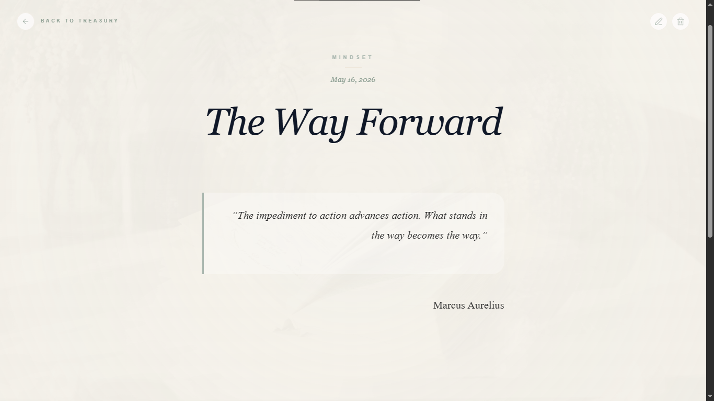
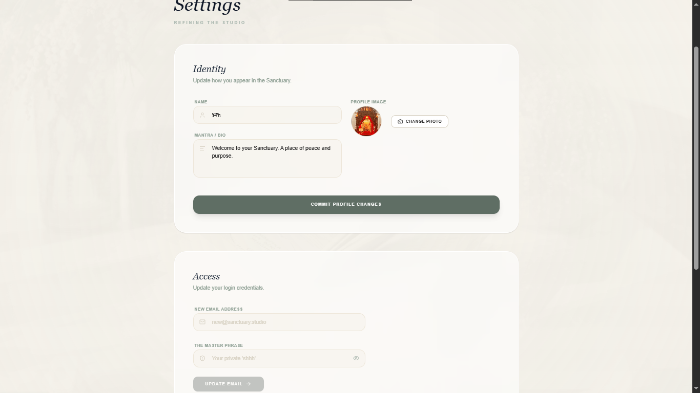

#Innerspace

A private digital sanctuary for reflective writing, protected thoughts, and timeless manuscripts.

Built with Next.js, TypeScript, MongoDB, JWT authentication, and a feature-based architecture.

---

## Preview

### Login Experience


### Dashboard



### Writing Studio



### Reading Experience



### Settings



---

## Features

### Authentication & Security

- JWT based authentication
- Protected routes using Next.js middleware
- Secure password update flow
- Secret phrase verification system
- Protected email update workflow
- Session invalidation after credential changes

### Writing Experience

- Rich text editor powered by Tiptap
- Beautiful manuscript style reading experience
- Category organization system
- Draft and publishing workflow
- Reflective writing focused UI

### User Experience

- Elegant sanctuary inspired interface
- Responsive design across devices
- Custom 404 experience
- Smooth transitions and micro-interactions
- Toast feedback system

### Architecture

- Feature-based architecture
- Server Actions integration
- MongoDB persistence with Mongoose
- Server/Client Component separation
- Reusable action-based patterns

### Media & Deployment

- Cloudinary image uploads
- Production deployment on Vercel

---

## Architecture

This project follows a feature-based architecture to improve scalability, maintainability, and separation of concerns.

```txt
src/
├── app/
│   ├── dashboard/
│   ├── login/
│   └── settings/
│
├── features/
│   ├── auth/
│   │   ├── actions/
│   │   ├── components/
│   │   └── lib/
│   │
│   ├── posts/
│   │   ├── actions/
│   │   ├── components/
│   │   ├── lib/
│   │   └── types/
│   │
│   └── settings/
│       ├── actions/
│       └── components/
│
├── lib/
├── models/
└── middleware.ts
```

### Architectural Decisions

- Feature-based organization instead of component based sprawl
- Separation between Server and Client Components
- Reusable server actions for mutations
- Middleware driven route protection
- Centralized MongoDB connection handling
- Lean rendering with serialized database responses

### Why This Structure?

As the project grew, maintaining everything inside the `app` directory became difficult.

The feature-based approach made it easier to:

- scale functionality independently
- isolate business logic
- reduce coupling
- improve readability
- create reusable modules

---

## Tech Stack

### Frontend

- Next.js 16
- React
- TypeScript
- Tailwind CSS

### Backend

- Next.js Server Actions
- MongoDB
- Mongoose

### Authentication & Security

- JWT Authentication
- bcryptjs
- Middleware based route protection

### Editor & Media

- Tiptap Editor
- Cloudinary Uploads

### Deployment

- Vercel

---

## What I Learned

Building Sanctuary Studio helped me deepen my understanding of modern full-stack architecture and production workflows.

Some of the most important concepts I learned include:

- Server vs Client Component boundaries in Next.js
- Structuring scalable feature-based architecture
- JWT authentication and middleware protection
- Secure credential update flows
- Rich text editor integration with Tiptap
- MongoDB modeling and serialization patterns
- Handling loading, error, and not-found states
- Production deployment workflows using Vercel

This project also improved my thinking around product design, UI consistency, and engineering organization.

---

## Live Demo

 Experience the live application:

[Open Innerspace Journal](https://innerspace-journal.vercel.app/)

---

## Installation

Clone the repository:

```bash
git clone https://github.com/Hena-yaris/innerspace-journal
```

Install dependencies:

```bash
npm install
```

Create an environment file:

```bash
cp .env.example .env.local
```

Run the development server:

```bash
npm run dev
```

---

## Author

Built with focus, reflection, and curiosity by Henok Tesfay.